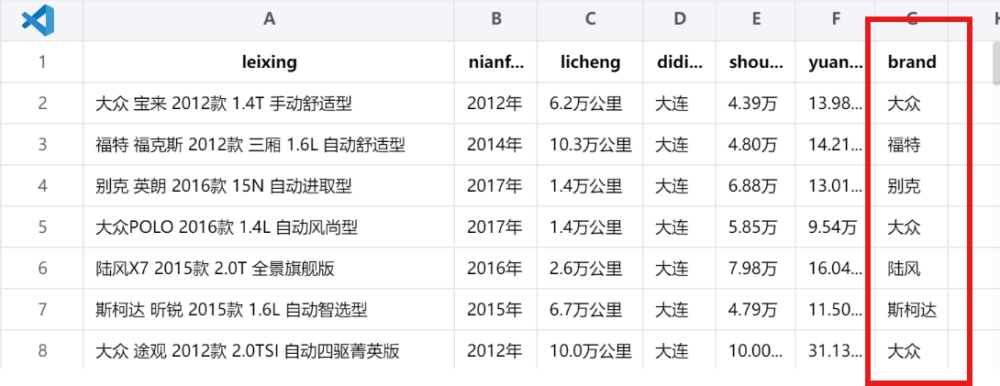
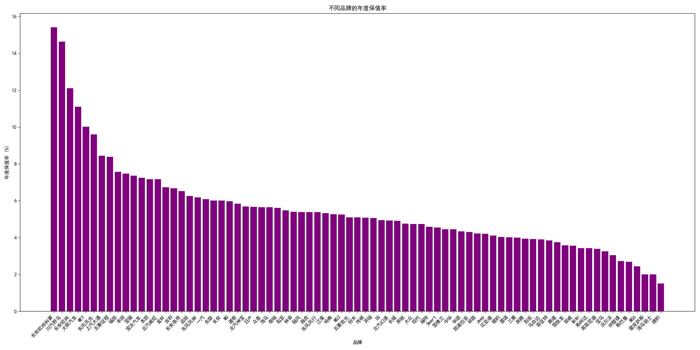
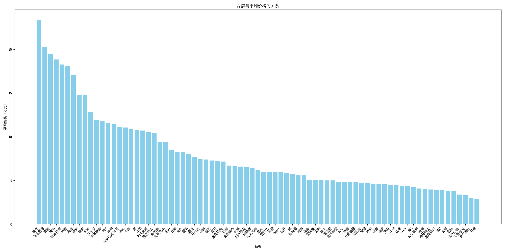
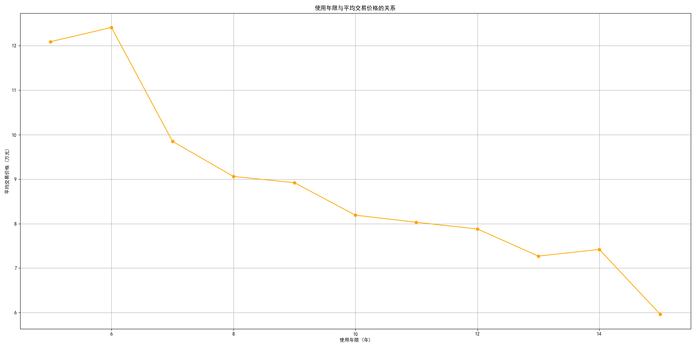
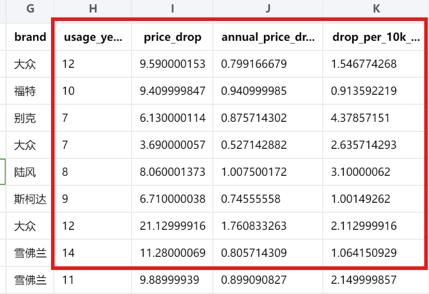

# 部署说明
>项目使用python3

### 1.终端使用 ``pip install -r requirements.txt``下载项目所需库

```
pandas~=2.2.3
pyspark~=3.5.3
matplotlib~=3.9.2
openpyxl~=3.1.2
```

### 2.终端运行 ``python tiqu.py``提取*guazi.csv*中的品牌信息存储到*guolv.csv*中



### 3.终端运行 ``python main.py``后将对*guolv.csv*进行处理，输出三张结果图以及一张结果表





